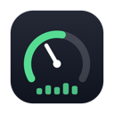
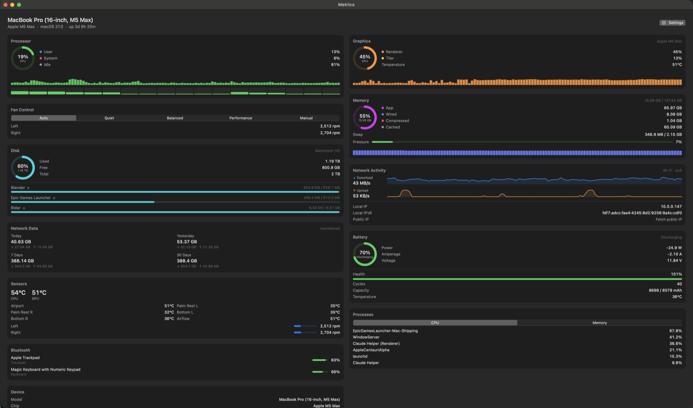

<div align="center">



# Metrics

[](https://github.com/BoatAngle/metrics/actions/workflows/ci.yml)

**A free, open macOS system monitor that lives in your menu bar.**

CPU, GPU, memory, disk, network, battery, temperatures, and real fan control —
in a glanceable menu bar, a full dashboard, live desktop widgets, recorded
history, analytics, and alerts. No accounts, no tracking — the only network
request Metrics ever makes is an optional once-a-day update check
([details below](#privacy)).

### [⬇︎ Download the latest version](https://github.com/BoatAngle/metrics/releases/latest)



</div>

---

## Install

1. **Download** [`Metrics.dmg`](https://github.com/BoatAngle/metrics/releases/latest) and open it.
2. **Drag `Metrics` onto the `Applications` folder** in the window that appears.
3. **Open it.** The first time, macOS blocks apps from outside the App Store:
   - Double-click Metrics — you'll see a message that it can't be opened.
   - Open **System Settings → Privacy & Security**, scroll down, and click
     **"Open Anyway"** next to the Metrics message. Confirm with Touch ID or your password.
   - That's a one-time step — after that it opens normally.

> **Why the extra step?** This build isn't yet notarized by Apple (that needs a
> paid developer account). "Open Anyway" tells macOS you trust it. A notarized
> build — which opens with no warning at all — will replace this download once
> code signing is in place.

Metrics runs in your menu bar. Click any menu bar item for the dashboard;
right-click it for Settings, Check for Updates, Focus mode, and Quit.

## Features

### Menu bar

- **As many items as you like**, each independently configured: CPU, GPU,
  memory, disk, battery, temperature, network — plus **Combined** (2–3 stacked
  mini-metrics in one slot), **Custom Format** (build your own text from
  tokens), any **temperature sensor** with a custom label, **fan RPM**, and a
  **top-process ticker**.
- **Five render styles** per item: text, line graph, bar meter, gauge, or a
  colored dot — with optional reactive colors and per-item warn/critical
  thresholds.
- **Per-item click actions**: open the popover, jump straight to a dashboard
  card, launch Activity Monitor, or cycle the fan mode.
- **Positions that stick.** Items remember their menu-bar slots across
  launches; a one-click "Group items at the far left" button parks them
  together, and ⌘-drag fine-tunes as usual. Fixed widths, so the menu bar
  never jumps around as numbers change.

### Dashboard

A window *and* a popover you can **pin open**. Drag cards to rearrange,
click a card's title to collapse it to a one-line live summary;
light / dark / system appearance.

- **Processor** — total, user and system load, plus a per-core strip grouped
  into efficiency / performance clusters on Apple Silicon.
- **Graphics** — GPU usage and temperature.
- **Power** — CPU, GPU, ANE and DRAM watts with a history chart and cluster
  clock speeds. On Apple Silicon the CPU figure is an estimate (marked "est.").
- **Memory** — usage, swap, and a live memory-pressure badge and bar.
- **Disk** — every volume with an eject button, live read/write I/O rates,
  **S.M.A.R.T. Drive Health** for the internal SSD (wear, spare, temperature),
  and a **capacity forecast** ("full in ~N days") from recorded free-space
  trends.
- **Network Activity** — down/up rates, top apps by throughput, and Wi-Fi
  details: SSID (click to copy), BSSID, channel, signal, noise, SNR, PHY rate,
  and a signal-strength sparkline.
- **Network Data** — usage today / yesterday / 7 days / 30 days, plus a
  **billing-cycle** view: pick the day your data plan resets and an optional
  monthly cap in GB.
- **Battery** — charge, health, cycles, watts / amperage / voltage, a 180-day
  **health history** chart, and — on supported Macs — an **80% charge-limit
  switch** with a "charge to 100% once" override. (The charge-limit controls
  appear only on hardware that supports them.)
- **Sensors** — every temperature sensor and fan, with **today / all-time
  records** of your Mac's extremes.
- **Processes** — top processes sortable by CPU, memory, disk, energy, or GPU
  (when available), a per-process **inspector** popover, and quit / force-kill
  with an inline confirm.
- **Bluetooth** — battery levels of connected devices.
- **Device** — hardware info plus **session stats**: average and peak CPU /
  GPU / temperature and data transferred since boot and since last wake.

### History & analytics

- **Recorded history** — charts switch between Live / 1h / 24h / 7d, backed by
  an on-disk SQLite store with rollups so weeks of data stay cheap. Everything
  is local: `~/Library/Application Support/Metrics/`.
- **This Week** — a weekly summary window with a **temperature heatmap
  calendar**, per-day network usage, headline totals, and the battery-vs-AC
  split.
- **Export** — dump any range of recorded history (last 24 h up to everything)
  as **CSV or JSON** from Settings.

### Alerts

A configurable rule engine: alert when a metric **rises above / drops below**
a threshold for a sustained number of seconds, with per-rule cooldowns.
Watchable metrics include CPU and GPU usage, the hotspot or any individual
temperature sensor, memory pressure, volume free space (% or GB), battery
charge and health, network rates, fan RPM, a single process's CPU or memory,
thermal state, and a weak charger. Alerts arrive as macOS notifications with
contextual actions, and recent alerts are kept in an in-app history.

### Fan control

Five modes: Auto (Apple's curve), Quiet, Balanced, Performance
(temperature-driven curves that ramp sooner than Apple's default), and Manual
(set exact RPM). Speeds are clamped to each fan's safe range, every curve goes
full-speed if things get hot, and your fans always return to automatic when
you quit.

### Focus / Gaming mode & hotkeys

- **Focus / Gaming mode** collapses every menu bar item into one compact icon,
  hides desktop widgets, and slows sampling to 5 s. Toggle it from the
  right-click menu, a hotkey, `metrics://focus/toggle` — or let it trigger
  automatically when an app goes full-screen or a chosen app comes frontmost.
- **Global hotkeys** for toggling the dashboard popover and Focus mode, active
  from any app.

### Widgets

- **Desktop widgets** — float any card right on the desktop, updating live,
  with size and theme options (glass, solid, minimal, terminal) and an
  arrange mode.
- **Apple widget gallery** — System, Battery, and Network widgets for macOS's
  own widget gallery too.

### Diagnostics & updates

- **Hardware diagnostics** — a one-click report in Settings that checks fans,
  sensors, battery, power/shutdown history and more, with pass / warn / fail
  verdicts and plain-language explanations.
- **Update check** — once a day Metrics asks GitHub whether a newer release
  exists and shows a banner if so. "Check for Updates…" also lives in the
  right-click menu. See [Privacy](#privacy).

## Privacy

Nothing phones home. The **only** outbound request Metrics ever makes is an
optional once-a-day version check against this repo's GitHub Releases — a
single anonymous HTTPS GET that sends nothing about you or your Mac. It's on
by default so you hear about fixes, and you can switch it off in
**Settings → About**. There are no accounts, no analytics, and all recorded
history stays in local files under `~/Library/Application Support/Metrics/`.

## Automation

Metrics can be driven from other apps, scripts, and Raycast/Alfred workflows.

**`metrics://` URL scheme** — open with `open metrics://…` or from any launcher:

| URL | Action |
| --- | --- |
| `metrics://dashboard` | Bring the dashboard window forward |
| `metrics://card/<kind>` | Open the dashboard scrolled to a card (`cpu`, `gpu`, `power`, `memory`, `disk`, `network`, `network_data`, `battery`, `sensors`, `fans`, `processes`, `bluetooth`, `device`) |
| `metrics://fan/<mode>` | Switch fan mode (`auto`, `quiet`, `balanced`, `performance`, `manual`) |
| `metrics://focus/<action>` | Focus / Gaming mode (`on`, `off`, `toggle`) |
| `metrics://copy/<metric>` | Copy a metric's current value to the clipboard (metric keys below) |

**`metricsctl` command-line tool** — ships inside the app bundle. Symlink it onto your `PATH`:

```sh
ln -s "/Applications/Metrics.app/Contents/MacOS/metricsctl" /usr/local/bin/metricsctl
```

```sh
metricsctl get cpu          # 12%
metricsctl json             # full snapshot as JSON
metricsctl fan quiet        # set the fan mode
metricsctl watch cpu        # stream the value once per second (Ctrl-C to stop)
```

`get`, `watch`, and `metrics://copy/…` share the same metric keys:
`cpu` `gpu` `memory` `swap` `power` `cpu-temp` `gpu-temp` `hotspot`
`battery` `net-down` `net-up` `disk` `ip` `fan`.

`metricsctl` talks to the running app over a Unix-domain socket at
`~/Library/Application Support/Metrics/metricsctl.sock`, so Metrics has to be
running.

## About fan control

Changing fan speeds requires administrator access (macOS doesn't allow apps to
control hardware directly), so Metrics installs a small helper the first time you
switch to a manual or curve mode — it'll ask for your password once. Your fans
always return to Apple's automatic control when you quit the app. If you also run
another fan app like Macs Fan Control, quit it first so they don't fight.

## Compatibility

- **macOS 14 Sonoma or later.**
- **Universal** — works on both Apple Silicon and Intel Macs.
- Adapts to your hardware: cards for things your Mac doesn't have (a battery on a
  desktop, fans on a MacBook Air, S.M.A.R.T. on drives that don't report it,
  charge-limit control on older machines, etc.) simply hide themselves.

## Build from source

Requires the Xcode Command Line Tools (no full Xcode needed):

```sh
git clone https://github.com/BoatAngle/metrics.git
cd metrics
./build.sh --run          # build a release and launch it
./build.sh --install      # build and install into /Applications
./test.sh                 # run the unit-test suite
swift run Metrics --dump  # print one sample of every metric to the terminal
```

## License

[MIT](LICENSE). Free and open — use it, fork it, tinker with it.
